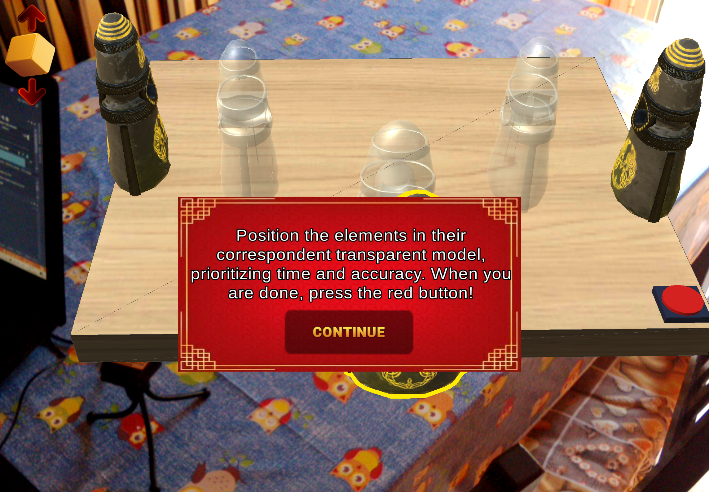
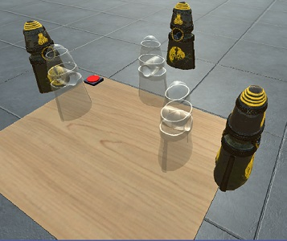
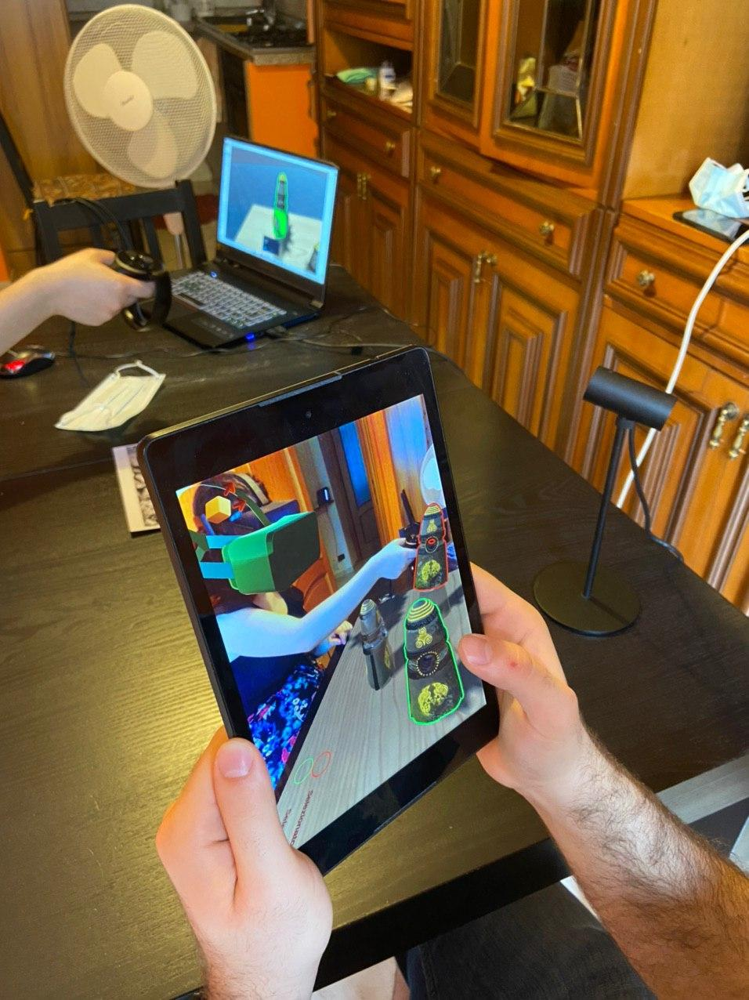

# Virtual Shared Reality CLIENT
{:height="50px" width="50px"}



This repository contains the application XListener created with unity 2018.8.8f1 for the thesis developed in PucRio TecGraph and Politecnico of Turin, it enables a multiplayer experience between a user with a virtual reality headset (HTC Vive pro, oculus quest or rift) and a tablet/cellphone user.
## Getting Started
To use this application you need to use also the server. 
1. Clone this project and WebApplication
2. Change the IP field in ClientManager in the unity editor with your IP
3. Run The application
### Prerequisites
To run this project I used Visual Studio 2019 and Unity 2018.8.8f1 editor, these are the steps that you should do:

1. Clone the repository
2. Download Vuforia sdk for android 


links
Vuforia sdk - https://developer.vuforia.com/downloads/sdk 
```
Give examples
```

### Installing

A step by step series of examples that tell you how to get a development env running

Say what the step will be

```
Give the example
```

And repeat

```
until finished
```

End with an example of getting some data out of the system or using it for a little demo

## Running the tests

Explain how to run the automated tests for this system

### Break down into end to end tests

Explain what these tests test and why

```
Give an example
```

### And coding style tests

Explain what these tests test and why

```
Give an example
```

## Deployment

Add additional notes about how to deploy this on a live system

## Built With

* [Unity 2018 ](https://unity3d.com/unity/whats-new/2018.4.8) - The editor used
* [SteamVR](https://maven.apache.org/) - Unity Plugin for VR development
* [Vuforia](https://rometools.github.io/rome/) - Unity Plugin for AR development

## Contributing

Please read [CONTRIBUTING.md](https://gist.github.com/PurpleBooth/b24679402957c63ec426) for details on our code of conduct, and the process for submitting pull requests to us.

## Versioning

We use [GitHubDesktop](http://semver.org/) for versioning. For the versions available, see the [tags on this repository](https://github.com/your/project/tags). 

## Authors

* **Salvatore Gurzì** 


## License


## Acknowledgments

* This project was developed with the help of Andrea Bottino, Francesco Strada and Renato Cherullo that I should thanks for
* the suggestions even if I had to pray on my knee like a bitch and send uncontable mails to have their attention
* 

